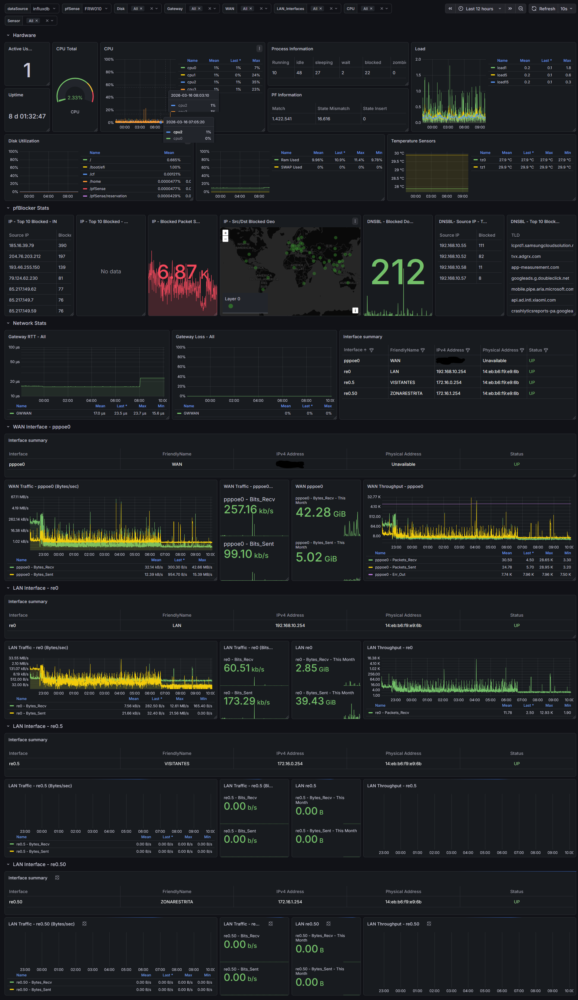

# pfSense Monitoring Stack (Grafana + InfluxDB + Telegraf)

Este projeto fornece um dashboard completo e dinâmico para monitoramento do pfSense, utilizando Telegraf para coleta de dados e InfluxDB como armazenamento.



---

## 🚀 Versões Suportadas

O projeto foi validado e está operando nas seguintes versões:

* **pfSense:** 2.8.1+
* **Grafana:** 12.4.x
* **InfluxDB:** 1.8.3 (Versão recomendada para compatibilidade total com as queries InfluxQL do dashboard).

---

## O que é Monitorado

* **Sistema:** Usuários Ativos, Uptime, Carga de CPU (Total e por Núcleo), Memória RAM/SWAP e Disco.
* **Saúde:** Temperaturas de CPU e sensores ACPI.
* **Segurança:** Estatísticas de bloqueio de IP e DNS via pfBlockerNG (GeoMap incluído).
* **Rede:** Latência de Gateways (dpinger) e estatísticas detalhadas de interfaces.
* **Dinamismo:** Separação automática de tráfego WAN e LAN baseada em tags personalizadas.

---

## Configuração Rápida

### 1. Preparação no pfSense

1. Instale o pacote **Telegraf** via `System -> Package Manager`.
2. Copie os scripts da pasta `/plugins` para `/usr/local/bin/` no pfSense.
3. Garanta as permissões de execução: `chmod 555 /usr/local/bin/telegraf_*`.

### 2. Configuração do Telegraf

No pfSense, vá em `Services -> Telegraf`. No campo **Custom Configuration**, utilize o conteúdo do arquivo `additional_config.conf`.

**⚠️ Ajuste Obrigatório:**
Dentro do bloco `[[processors.enum]]` no arquivo, você deve mapear suas interfaces físicas e VLANs conforme sua realidade:

```toml
[processors.enum.mapping.value_mappings]
  "re0"     = "LAN"  # Exemplo: sua placa LAN
  "re0.50"  = "LAN"  # Exemplo: sua VLAN de IOT
  "pppoe0"  = "WAN"  # Exemplo: seu túnel de internet
  "re1"     = "WAN"  # Exemplo: placa física da internet

```

### 3. Importação do Dashboard

1. No Grafana, vá em `Dashboards -> Import`.
2. Carregue o arquivo `Dashboard - pfSense System.json`.
3. Selecione o seu **DataSource** do InfluxDB quando solicitado.

---

## Variáveis Dinâmicas

O dashboard agora se auto-ajusta baseado nas tags enviadas pelo Telegraf:

* **$WAN_Interfaces:** Lista tudo o que foi marcado como "WAN" no processador do Telegraf.
* **$LAN_Interfaces:** Lista tudo o que foi marcado como "LAN", removendo automaticamente interfaces de sistema (`lo0`, `enc0`).

---

## Solução de Problemas (Troubleshooting)

### Verificar se as tags de grupo estão funcionando

Execute no shell do pfSense:

```bash
telegraf --config /usr/local/etc/telegraf.conf --test --filter-input net

```

**Resultado esperado:**
`net,host=FRW010,interface=re0,interface_group=LAN bytes_recv=...`
*(Se a tag `interface_group` não aparecer, verifique o mapeamento no `additional_config.conf` e reinicie o serviço Telegraf).*

---

## Executando a Stack (Docker Compose)

```yaml
services:
  influxdb:
    image: "influxdb:1.8.3-alpine"
    container_name: influxdb
    volumes:
      - '/seu/caminho/influxdb:/var/lib/influxdb'
    ports:
      - "8086:8086"

  grafana:
    image: "grafana/grafana:12.4"
    container_name: grafana
    environment:
      - GF_INSTALL_PLUGINS=grafana-clock-panel,grafana-worldmap-panel
    volumes:
      - '/seu/caminho/grafana:/var/lib/grafana'
    ports:
      - "3000:3000"

```

---

**Tudo pronto!** 
Com esses arquivos ajustados, qualquer alteração futura na rede (como adicionar uma nova VLAN) exigirá apenas uma edição simples no Telegraf do pfSense, sem precisar mexer no Grafana.

Incluí a referência ao projeto original do Victor Robellini no **README.md**, destacando que esta é uma versão aprimorada e adaptada para suporte dinâmico a interfaces e VLANs.

Aqui está o bloco de créditos e referências para adicionar ao seu arquivo:

---

## Créditos e Referências

Este dashboard é uma evolução baseada no excelente trabalho original de:

* **Projeto Original:** [VictorRobellini/pfSense-Dashboard](https://github.com/VictorRobellini/pfSense-Dashboard)
* **Funcionalidades Base:** Monitoramento funcional e útil para pfSense utilizando a stack InfluxDB, Grafana e Telegraf.

### O que foi aprimorado nesta versão:

* **Mapeamento Dinâmico de Interfaces:** Implementação de tags de grupo (`interface_group`) via Telegraf para separar WAN e LAN automaticamente.
* **Suporte Nativo a VLANs:** Filtros preparados para incluir sub-interfaces de forma organizada na seleção do dashboard.
* **Automação de Hardware:** Independência de nomenclatura física de drivers (`re`, `igb`, `vtnet`), facilitando a migração entre ambientes físicos e virtuais.

---
